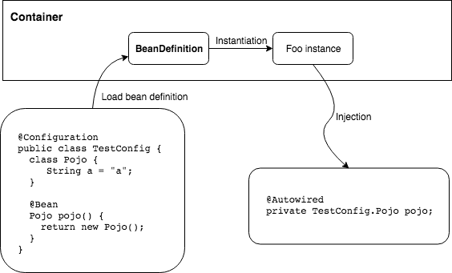

# 彻底理解IOC容器

## 什么是IoC

IoC或者DI，我更喜欢后者，即依赖注入。当一个类实例化的时候，所依赖的字段或构造器参数，不是由代码显式实例化，而是由容器注入。正如下图所示：Pojo作为依赖，不是主动地new出来的，而是由容器注入的，Pojo的创建是由容器根据Bean定义创建的。



因此，我们得出一个非常重要的结论：

> IoC容器的工作流程：  
> 1. 加载Bean定义，XML或者注解方式  
> 2. 根据定义实例化对象  
> 3. 注入对象

我们可以通过以下代码来验证：

name

## 基本概念

Bean，是受SpringIOC容器管理的对象。容器可看做是装Bean的"罐子"，提供注册，查找Bean等功能。
容器的顶层接口BeanFactory中的几个核心方法，实现了容器的基本功能：

```
public interface BeanFactory {
    Object getBean(String name) throws BeansException;
    <T> T getBean(Class<T> requiredType) throws BeansException;
    boolean containsBean(String name);
    boolean isSingleton(String name) throws NoSuchBeanDefinitionException;
    boolean isTypeMatch(String name, ResolvableType typeToMatch) 
          throws NoSuchBeanDefinitionException;
}          
```

Bean在容器中是如何定义的呢？就像类之于对象，BeanDefinition就是Bean的定义。下面是BeanDefinition的
核心属性：

```
Class: 是什么
Name: 叫什么
Scope：是否单例
Constructor arguments: 构造器参数
Properties：属性
Autowiring mode：装配模式
Lazy initialization mode：懒加载
Init/Destroy method: 初始化，销毁方法
```

理解Bean和容器，BeanDefinition这三个基本概念：BeanDefinition定义Bean，容器管理Bean。这样，我们
就能在Spring的世界里策马奔腾了。


